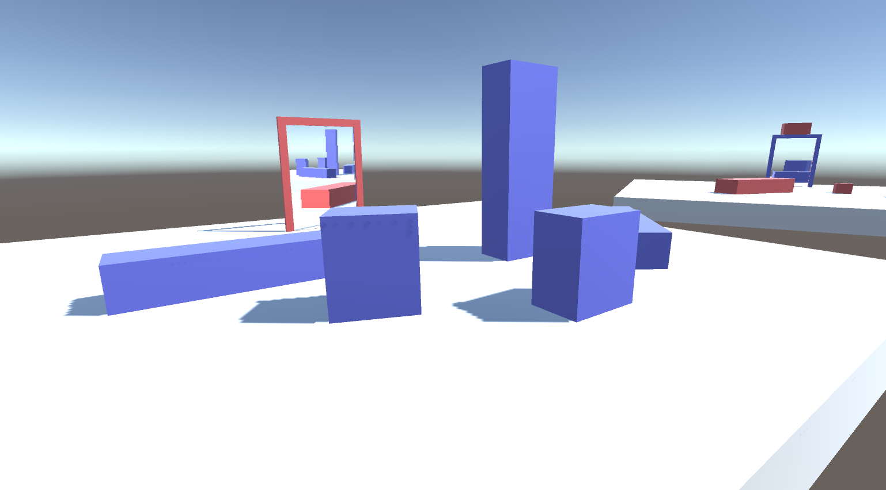

# unity-portal-rendering

## Overview

Super small example of using off-screen render targets to achieve a portal effect in Unity.

## Info

Please see this accompanying blog post <http://tomhulton.blogspot.co.uk/2015/08/portal-rendering-with-offscreen-render.html> for an explanation of the techniques involved.

UPDATE (2019/01/28): Added touch screen camera controls when running on device.  
UPDATE (2019/01/21): Added teleportation (so moving through a portal will spit you out the other side).

Note: There's an artefact you'll encounter when moving through a portal where the near clip plane of the camera will clip with the portal texture quad. You wouldn't get this if using the portal stencil buffer technique but unfortunately with render buffers there's no clean way around it. The logic can still be applied if you'd like to use it elsewhere.

## Controls

### Desktop

WASD - Camera forward/backward/strafe  
EQ - Camera adjust height  
Right Mouse Button + Mouse Move - Look around  
C - Cycle between main camera and portal camera views  

### Device

One Finger, Hold + Move - Look around  
One Finger, Double Tap + Hold - Move forward  
Two Fingers, Pinch - Move forward/backward  
Two Fingers, Pan - Move up/down/left/right (Camera space)  
Three Fingers, Tap - Cycle cameras  